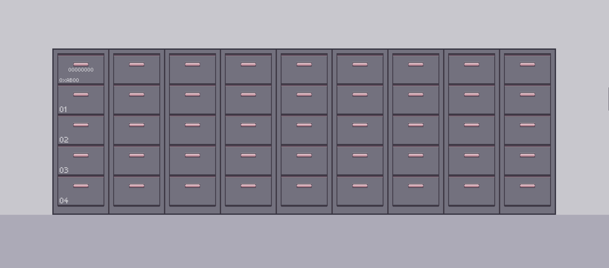

# +Variables

Quando programamos, estamos dando instruções a um computador para que ele execute uma determinada tarefa. Para isso, ele usa dois recursos essenciais: a memória e o processamento.

- Memória: serve para armazenar informações, como números, textos ou imagens.
- Processamento: é usado para realizar cálculos e manipular as informações que estão na memória.

O computador é uma máquina eletrônica e, por isso, só entende a passagem ou a ausência de corrente elétrica. Para representar isso, usamos o sistema binário, que consiste em apenas dois dígitos: 0 e 1.

- O número 0 em binário é 0.
- O número 1 em binário é 1.
- O número 2 em binário é 10.
- O número 3 em binário é 11.

E assim por diante...

A unidade básica de informação é o Bit, que é um único dígito binário (um 0 ou um 1). Para representar informações mais complexas, combinamos vários bits. A combinação mais comum é o Byte, que é um conjunto de 8 bits.

Por exemplo, um byte pode ser a sequência 00000000 (que representa o número 0) ou 00000001 (o número 1). A maior sequência de 8 bits é 11111111, que representa o número 255. Com um byte, podemos representar 2^8=256 valores diferentes (de 0 a 255), pois cada um dos 8 bits pode ser 0 ou 1.

A forma mais simples de se definir uma variável é: um espaço reservado na memória para armazenar informações. Como as informações "podem variar, logo variável".

Porém, temos que entender também como funciona a memória em um computador:

Memoria

Pense em uma memoria como varias caixinhas, espacos vazios em que voce vai guardar algo e cada espaco possui um endereco

Imagine um armario e voce vai guarda algo nele, porem ele nao tem um identificador! Como voce vai encontrar o que voce guardou? Dificil ne?

A memoria funciona com espacos que vao guadar a informacao e cada espaco possui um endereco. Mas lembre-se cada espaco possui apenas 8 Bytes, logo se a informacao nao cabe em 1 caixa, ele quebra ela e guarda em 2, se nao der, ele quebra e guarda em 3 ...

Dado = [00000000] 0xCB20

1 Byte   = [00000000]
Endereco = 0xCB20

[00000001] 0xCB20
[00000010] 0xCB21
[00000011] 0xCB22
[00000101] 0xCB23
[00000111] 0xCB24

